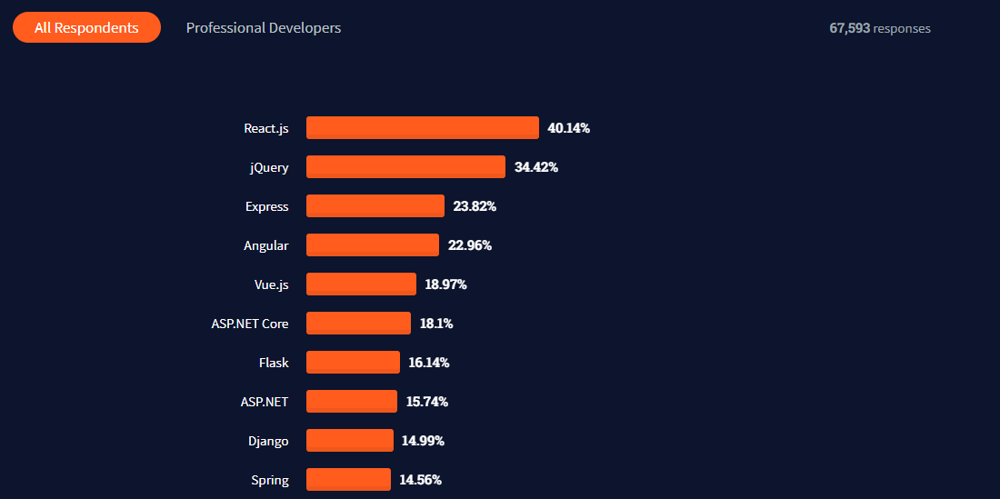
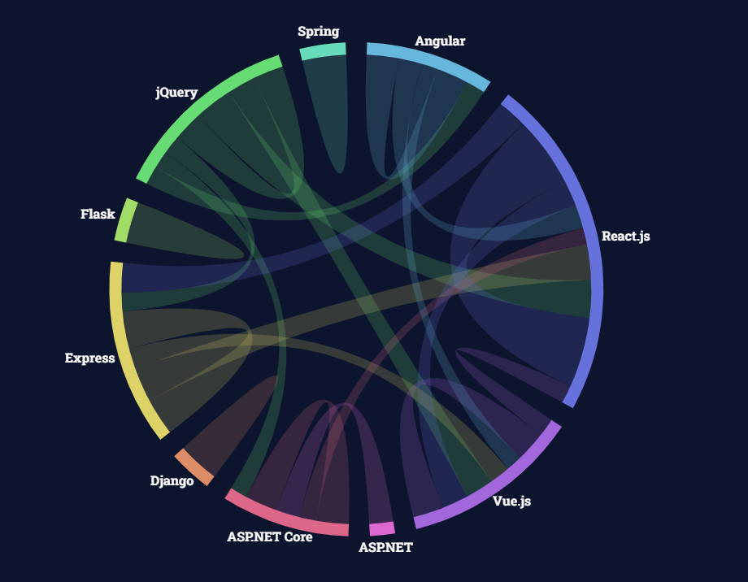
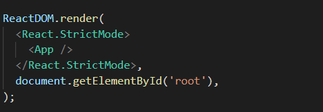
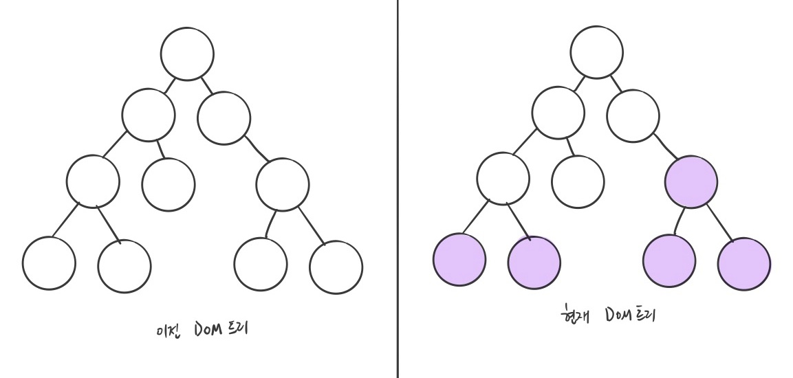

# 1주차 React 스터디 정리

| 장   | 제목          |
| ---- | ------------- |
| 1장  | 리액트의 시작 |
| 2장  | JSX           |
| 3장  | 컴포넌트      |

## 들어가기에 앞서

리액트는 2021년 현재 프론트엔드에서 가장 유명하고 많이 사용하는 프레임워크입니다

실제로 최대 프로그래밍 커뮤니티 사이트인 Stack Overflow의 2021년 통계를 보면 리액트가 얼마나 많은 사람들이 사용하고 많은 프로그래머들이 같이 일하기를 원하는지 알 수 있습니다





좀 더 자세한 내용은 [여기에서 보실 수 있습니다](https://insights.stackoverflow.com/survey/2021#technology-most-popular-technologies)

## `1장`

### 왜 리액트인가

기존 자바스크립트는 모델 데이터를 조회, 수정한 것을 뷰에 반영하려 할때 어떤 부분을 찾아서 변경할지 규칙을 정하는 일이 있었습니다

이런 규칙은 간단해보이지만 규모가 커지면 상당히 복잡해지고 때에 따라 성능저하가 발생하기도 했었습니다

페이스북 팀은 이런 규칙을 정하는 것이 아닌 뷰를 다 날려버리고 새로 렌더링 하는 방식을 개발했는데 이게 리액트입니다

이렇게하면 어떤 변화를 줄지 신경 쓸 필요가 없고 규칙에 때라 새로 렌더링하면 됩니다


### 리액트 이해

- 리액트는 `View`만 신경쓰는 라이브러리입니다

```
보통 프레임워크는 각각 Model, View, Contorl을 뜻하는 MVC 패턴을 가지고 있지만 리액트는 오직 `View`만 관리허면 됩니다
```

- 컴포넌트란?

```
특정 부분이 어떻게 생길지 정하는 선언체를 `컴포넌트(Component)`라고 합니다

컴포넌트의 가장 큰 장점은 페이지를 여러개로 나눠 재사용 가능하게 만들어줍니다
```
```
// 메인페이지
const Home = () => {
  {/* 페이지 구성을 여러개로 나눠 재사용할 수 있다 */}
  <Header />
  <Postings />
  <Footer />
};

export default Home;
```
- `초기 랜더링`과 `리랜더링`
```
사용자 화면에 보여 주는 것을 렌더링이라고 합니다

리액트는 렌더링 방식으로 두 가지가 있는데 컴포넌트가 최초로 실행한 `초기 렌더링`과 데이터 변경으로 다시 실행되는 `리렌더링`이 있습니다
```

### 초기 렌더링

리액트의 초기 렌더링은 다음의 과정을 거칩니다
```
렌더링 함수 발생 → HTML 마크업 → 실제 페이지의 DOM에 주입 → 페이지 렌더링 끝
```
아래는 실제 리액트 프로젝트의 `index.js`에서 사용되는 render 함수입니다


### 조화 과정

뷰를 업데이트 하는 과정을 `조화 과정` 이라고 합니다

업데이트를 하는 것 처럼 보이지만 실제로는 변화가 필요한 부분을 다 날리고 render 함수를 통해 다시 렌더링하게 됩니다


### 리액트의 특징

리액트의 특징 중 하나는 Virtual DOM을 사용하는 것입니다

! 여기서는 DOM에 대해서는 자세히 다루지 않겠습니다 DOM에 대한 내용은 [여기를 참고해주세요](https://ko.wikipedia.org/wiki/%EB%AC%B8%EC%84%9C_%EA%B0%9D%EC%B2%B4_%EB%AA%A8%EB%8D%B8)

### Virtual DOM

```
Virtual DOM은 이름 그대로 DOM을 추상화한 JS 객체를 구성해 사용합니다. 이를 통해 더 가볍게 DOM을 이용할 수 있게 됩니다

리액트에서 데이터가 변해 실제 DOM에 업데이트하는 과정은 '조화 과정'에 설명한 부분과 같습니다
```

### 기타 특징

```
오직 View만 제공하기에 라우팅이나 비동기 처리, 상태 관리를 기본 지원하지 않습니다

하지만 라우팅은 리액트 라우터, 비동기 처리에는 axios, 상태 관리에는 recoil등 상황에 맞는 라이브러리를 사용해 이런 문제를 해결할 수 있습니다
```

### 작업 환경 설정

### 기본 프로그램 설치

- [Node.js](https://nodejs.org/en/)
- [yarn](https://yarnpkg.com/)
- [Visual Studio Code](https://code.visualstudio.com/)
- [Git](https://git-scm.com/)

macOS 를 사용중이시라면 아래 명령어로 모든 것들을 해결하실 수 있습니다.

```shell
brew install node && brew install yarn && brew install --cask visual-studio-code && brew install git
```
⚠️ macOS 사용자 분들중에 homebrew를 모르신다면 [여기](https://subicura.com/mac/)를 참고해주세요!

### 프로젝트 생성하기

```
yarn create react-app (project-name)
```

### 프로젝트 실행하기

```
(prkject-name 폴더로 이동 후)
yarn start
```

## `2장`

### 웹팩
리액트에서는 import를 통해 모듈들을 불러와 사용할 수 있습니다

```
import React from 'react';
import someMoudle from 'modulePath'
```

여기서 알아야 할 점은 원래 브라우저에서 모듈 import를 지원하지 않습니다 이 기능은 `Node.js`에서 지원하는 기능입니다

이런 기능을 브라우저에서 사용하기 위해 `번들러`를 사용하는데 대표적으로는 webpack 이라는 도구가 있습니다. 웹팩에 대한 내용은 아직 다루지 않겠습니다

### JSX

```
study1_jsx 이미지 넣기
```

프로젝트를 실행하고 App.js 파일의 return 부분을 보면 HTML과 유사한 코드를 볼 수 있습니다

이는 HTML이 아닌 JSX라고 하며 자바스크립트의 확장 문법입니다

#### JSX의 장점

- 보기 쉽고 익숙합니다
```
HTML과 유사한 작성법이기에 익숙합니다
```
- 활용도가 높습니다

```
JSX에서는 HTML 문법을 쓸 수 있을 뿐더러 컴포넌트도 작성할 수 있습니다
```

#### JSX의 문법

- 여러 컴포넌트를 작성한다면 반드시 부모 요소로 감싸야합니다
```
// 에러! 여러 컴포넌트를 가지고 있지만 이를 감싸주는 부모 요소가 없다
const App = () => {
    return(
        <CounterContainer />
        <hr />
        <TodosContainer />
    );
};
```
```
// 올바른 작성법
const App = () => {
    return(
        <div>
            <CounterContainer />
            <hr />
            <TodosContainer />
        </div>
    );
};

// 혹은 이렇게도 가능합니다
const App = () => {
    return(
        <> {/* 또는 <Fragement> 요소로 감싸도 됨 */}
            <CounterContainer />
            <hr />
            <TodosContainer />
        </>
    );
};
```

- 자바스크립트 표현은 `{ }`
```
const App = () => {
    const name = 'myName'
    return(
        <div>
            <h1>나의 이름은</h1>
            {name}
        </div>
    );
};
```

- if문 대신 조건부 연산자

[자바스크립트의 조건부 연산자](https://developer.mozilla.org/ko/docs/Web/JavaScript/Reference/Operators/Conditional_Operator)
```
const App = () => {
    const name = 'myName'
    return(
        <div>
            {name === 'myName' ? (
                <h1>올바른 이름</h1>
            ):(
                <h1>틀린 이름</h1>
            )}
        </div>
    );
};
```
만약 조건이 `True`일때만 렌더링을 하고 싶다면 `&&`
```
const App = () => {
    const name = 'myName'
    return(
        <div>
            {name === 'myName' ? && <h1>올바른 이름</h1>}
        </div>
    );
};
```

- undefined 값만 반환해 렌더링하는 상황을 만들면 안됩니다
(단, JSX 내부에서 undefined를 렌더링하는건 괜찮습니다)
```
// 에러! undefined 값을 리턴함
const App() => {
  const name = undefined
  return name
}
```
```
// JSX 내부에서는 가능합니다
const App() => {
  const name = undefined
  return <div>name</div>
}
```

- 값이 undefined일 수도 있다면 `||`
```
const App() => {
  const name = undefined
  return name || 'name is undefined'
}
```

- 인라인 스타일링

DOM 요소에 스타일을 적용하려면
1. 객체형태로 넣어줍니다
2. 카멜 표기법으로 작성합니다

이 부분은 추후 Sass 혹은 styled-component 등을 사용하므로 넘어가겠습니다

- class 대신 className
```
// 에러!
const App() => {
  return <div class='myClass'></div>
}
```
```
// class 대신 className
const App() => {
  return <div className='myClass'></div>
}
```
리액트 16버전부터는 class를 써도 정상적으로 작동은 되지만 다음과 같은 메시지가 발생하게됩니다
```
study1_className 이미지 넣기
```

- 태그는 꼭 닫자

원래 HTML에서는 닫는 태그가 없어도 작동되는 태그가 있습니다 예를들어 `<br>` `<hr>` `<input>`가 그런 경우입니다

하지만 리액트에서는 꼭 닫는 태그가 있어야합니다 `<br />` `<input />`처럼요


- JSX 내에서 주석은 `{/*  */}`


### ESLint와 Prettier 적용하기
혼자 코딩을 하면 괜찮지만 협업을 하는 경우 코딩 스타일이 달라 혼란이 생길 수도 있습니다

이를 해결하기 위해 ESLint와 Prettier를 적용하는데 각각 문법 검사 도구, 코드 스타일 자동 정리 도구입니다

이 둘을 설치하지 않았다면 VS code 마켓에서 설치해주세요

만약 리액트 문법을 어기게 된다면 `ESLint`가 밑줄과 함께 에러 메시지를 표시할 것입니다

`Prettier`를 사용하려면 `F1`을 누르고 `format`을 입력후 `Enter`를 누르세요

이 둘은 규칙을 세팅할 수 있는데 추후 프로젝트에서 세팅을 하게 될수도 있습니다

## `3장`

컴포넌트를 작성하는 방법에는 `클래스형 컴폰넌트`와 `함수형 컴포넌트`가 있습니다

### 클래스형 컴포넌트


